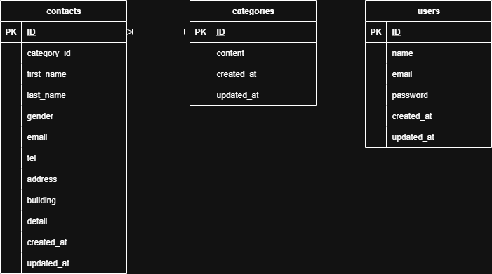

# お問い合わせフォーム

## 環境構築

Docker ビルド

1. git clone git@github.com:YAMADAMASAYUKI516/test_contact-form.git
2. docker-compose up -d -build

＊ MySQL は、OS によって起動しない場合があるのでそれぞれの PC に合わせて docker-compose.yml ファイルを編集してください。

Laravel 環境構築

1. docker-compose exec php bash
2. composer install
3. .env.example ファイルから.env を作成し、環境変数を変更
4. php artisan key:generate
5. php artisan migrate
6. php artisan db:seed

## 使用技術

- PHP 8.0
- Laravel 10.0
- MYSQL 8.0

## ER 図

## URL

- 開発環境：http://localhost/
- phpMyAdmin：http://localhost:8080/
